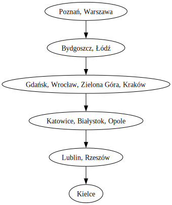
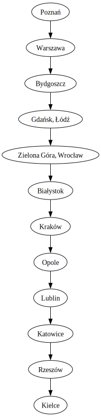
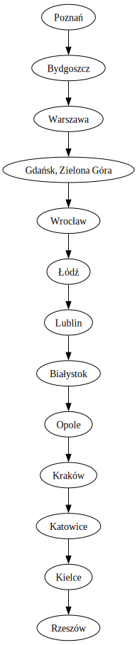
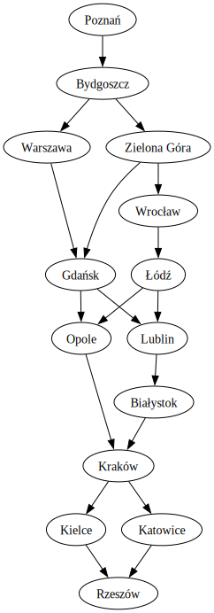

## Sprawozdanie z projektu ELECTRE III + PROMETHEE
# Inteligentne Systemy Wspomagania Decyzji

Autorzy: Kamil Kałużny, Mariusz Hybiak

## Wstęp

## 1 Zbiór danych
#### 1. Jaka jest domena problemu?
Domeną problemu jest wybór miasta, które odwiedzimy w wakacje.
#### 2. Jakie jest źródło danych?
Zbiór danych został skonstruowany na podstawie następujących źródeł:
* Czas dojazdu samochode:   Mapy Google
* Liczba ludności:  Wikipedia (GUS)
* Średnia temperatura w lipcu:  Klimatogramy (Climate-data.org)
* Liczba deszczowych dni w lipcu:   Klimatogramy (Climate-data.org)
* Zanieczyszczenie powietrza:   Wikipedia (EEA)

#### 3. Jaki jest punkt widzenia decydenta?

Z punktu widzenia decydenta:
- Im krótsza droga, tym lepiej (koszt);
- Im więcej mieszkańców, tym więcej ciekawych osób można poznać (zysk);
- Im wyższa średnia temperatura, tym większa szansa na ciepły dzień (zysk);
- Im niższa liczba deszczowych dni, tym mniejsza szansa na złą pogodę (koszt);
- Im wyższa pozycja w rankingu czystości powietrza, tym przyjemniejsza atmosfera do zwiedzania (zysk);

#### 4. Jaka jest liczba rozważanych wariantów? Czy w oryginalnym zbiorze danych było ich więcej?

Liczba rozważanych wariantów to 14. Taki zbiór został skonstruowany.

**Zbiór danych**:
| Oznaczenie | Miasto        | Czas dojazdu samochodem | Liczba ludności | Średnia temperatura w lipcu | Liczba deszczowych dni w lipcu | Zanieczyszczenia powietrza |
|------------|---------------|-------------------------|-----------------|-----------------------------|--------------------------------|-----------------------------|
| $v_0$      | Białystok     | 306.0                   | 293413          | 19.5                        | 10                             | 5                           |
| $v_1$      | Bydgoszcz     | 118.0                   | 337666          | 19.4                        | 9                              | 5                           |
| $v_2$      | Gdańsk        | 226.0                   | 486022          | 18.9                        | 10                             | 5                           |
| $v_3$      | Poznań        | 57.0                    | 546859          | 19.8                        | 9                              | 5                           |
| $v_4$      | Katowice      | 214.0                   | 289162          | 19.5                        | 11                             | 1                           |
| $v_5$      | Kielce        | 246.0                   | 192498          | 19.4                        | 10                             | 2                           |
| $v_6$      | Kraków        | 265.0                   | 800653          | 19.5                        | 11                             | 1                           |
| $v_7$      | Lublin        | 285.0                   | 334681          | 17.8                        | 9                              | 5                           |
| $v_8$      | Łódź          | 133.0                   | 670642          | 19.5                        | 10                             | 3                           |
| $v_9$      | Opole         | 159.0                   | 127839          | 20.1                        | 10                             | 4                           |
| $v_{10}$   | Rzeszów       | 359.0                   | 198609          | 19.8                        | 12                             | 3                           |
| $v_{11}$   | Warszawa      | 186.0                   | 1860281         | 18.0                        | 9                              | 3                           |
| $v_{12}$   | Wrocław       | 105.0                   | 672929          | 20.1                        | 9                              | 2                           |
| $v_{13}$   | Zielona Góra  | 134.0                   | 140403          | 20.1                        | 9                              |     5                      |

#### 5. Jakie są typy poszczególnych kryteriów?:

|Kryterium|ciągłe/dyskretne|zysk/koszt | osiągane wartości| oznaczenie
|--|--|--|--|--|
|Czas dojazdu samochodem [min]| dyskretne | koszt |[359,57] |$g_1 \downarrow$ |
| Liczba ludności |dyskretne| zysk | [127839,1860281] | $g_2 \uparrow$  |
| Średnia temperatura w lipcu | dyskretne | zysk | [17.8, 20.1] |$g_3 \uparrow$ |
| Liczba deszczowych dni w lipcu | dyskretne | koszt | [9,12] |$g_4 \downarrow$ |
| Zanieczyszczenie powietrza | dyskretene | zysk | [1,5] |$g_5 \uparrow$  |

#### 6. Opisz jeden z rozważanych wariantów - jak jest oceniony na poszczególnych kryteriach, jak dobry jest na tle innych.

|Miasto| $g_1$ | $g_2$| $g_3$ | $g_4$| $g_5$ |
|--|-----------|------------|-------------|--------|------------------|
|Poznań| 57  | 546859     | 19.80       | 9      | 5              |

Poznań wydaje się osiągać bardzo dobre wyniki, w szczególności na kryterium $g_1$ na którym znacząco pokonuje pozostałe warianty. Wygląda również jako jeden z lepszych na kryterium $g_2$ i przywoicie dla $g_3$. Osiąga również najlepsze wyniki dla $g_4$ oraz $g_5$.

#### 7. Ile rozważasz kryteriów? Czy było ich więcej w oryginalnym zbiorze danych?

Liczba rozważanych kryteriów to 5. Taki zbiór został skonstruowany. Kryterium __zanieczyszczenie powietrza__ orginalnie reprezentowane jako numer na liście najbardziej zanieczyszconych miast w Polsce - zostało stworzone kategoryzując wartości do zbioru: {1,2,3,4,5} - kryterium typu zysk.

#### 8. Jakie są wagi poszczególnych kryteriów?

Ze względu na bardzo podobne wartości poszczególnych wariantów dla kryterium $g_3$ przyjmujemy dla niego niższą wagę, oraz ze względu na istotność poziomu zanieczyszczenia powietrza przypisujemy mu wagę większą. Pozostałe kryteria traktujemy na takim samym poziomie istotności.  
Wybrane wagi: $[2,2,1,2,3]$.

#### 9. Czy istnieją jakieś dominacje w zbiorze wariantów? Jeśli tak, podaj je.

$v_1 \Delta v_5$ \,
$v_1 \Delta v_7$, 

$v_3 \Delta v_0$ \, $v_3 \Delta v_1$ \, $v_3 \Delta v_2$ \, $v_3 \Delta v_4$ \, $v_3 \Delta v_5$ \, $v_3 \Delta v_7$ \, $v_3 \Delta v_{10}$ \,

$v_8 \Delta v_4$ \,
$v_8 \Delta v_5$ \,

$v_{12} \Delta v_4$ \,
$v_{12} \Delta v_5$ \,

$v_{13} \Delta v_9$

#### 10. Jak teoretycznie powinien prezentować się najlepszy wariant w Twoim zbiorze danych?

Najlepszy wariant w naszym zbiorze powinien uzyskiwać wysokie wartości dla $g_5$ i zrównoważone jakościowo wyniki dla pozostałych kryteriów.

#### 11. Spośród rozważanych wariantów, który wydaje się być najlepszy/lepszy od innych i dlaczego?

Najlepszym spośród rozważanych wariantów wydaje się być Poznań ze względu na to, że osiąga najlepsze wyniki dla kryteriów $g_1$, $g_4$, $g_5$, jednocześnie nigdy nie osiągając najniższych wartości.

#### 12. Spośród rozważanych wariantów, który wydaje się być najsłabszy/ znacząco słabszy od innych i dlaczego?

Najsłabszy wydaje się Rzeszów ze względu na fakt położenia geograficznego - bardzo daleko od Jarocina - osiąga najgorsze wyniki na kryteriach $g_1$ oraz $g_4$.

## 2 Analiza problemu z wykorzystaniem ELECTRE III

#### 1. Zapisz informację preferencyjną podaną na wejście metody.
Progi oraz wagi dla każdego kryterium:  
$q_1=30$, $p_1=60$, $w_1=2$, $v_1=240$  
$q_2=50000$, $p_2=100000$, $w_2=2$, $v_2=500000$ 
$q_3=1$, $p_3=3$, $w_3=1$, $v_3=5$  
$q_4=1$, $p_4=3$, $w_4=2$, $v_4=5$  
$q_5=0$, $p_5=2$, $w_5=3$, $v_5=4$  

Gdzie:
$q_i$ to próg nierozróżnialności dla kryterium $i$,
$p_i$ to próg prefernecji dla kryterium $i$,
$v_i$ to próg veto dla kryterium $i$ a
$w_i$ to waga dla kryterium $i$.

#### 2. Podaj ranking końcowy, rangi uzyskane na jego podstawie i ranking medianowy.

| *Ranking wstępujący* | *Ranking zstępujący*|
|:------------------:|:------------------:|
|  |  |

| *Ranking końcowy* | *Rangi* | *Ranking medianowy* |
|:------------------:|:------------------:|:--------------:|
|  |  |  |
#### 3. Skomentuj otrzymane wyniki, porównując je ze swoimi oczekiwaniami i preferencjami (zapewnionymi wcześniej)
Poznań zgodnie z naszymi oczekiwaniami został wybrany we wszystkich rankingach jako najlepszy wariant. Natomiast Rzeszów, który zakładaliśmy, że będzie najgorszym wyborem, co ciekawe został uznany za lepszą alternatywe dla Kielc. Pozostałe wyniki są w większości zgodne z naszymi oczekiwaniami. Trochę dziwić może bardzo wysoki wynik Warszawy, która nie ma najczystszego powietrza, możliwe jednak że bardzo duża liczba ludności odegrała tutaj kluczową rolę.

## 3 Analiza problemu z wykorzystaniem PROMETHEE I i II

#### 1. Zapisz informację preferencyjną podaną na wejście metody.
Progi oraz wagi dla każdego kryterium:  
$q_1=30$, $p_1=60$, $w_1=2$  
$q_2=50000$, $p_2=100000$, $w_2=2$ 
$q_3=1$, $p_3=3$, $w_3=1$  
$q_4=1$, $p_4=3$, $w_4=2$  
$q_5=0$, $p_5=2$, $w_5=3$  

Gdzie:
$q_i$ to próg nierozróżnialności dla kryterium $i$,
$p_i$ to próg prefernecji dla kryterium $i$ a
$w_i$ to waga dla kryterium $i$.

Dla każdego wariantu wykorzystaliśmy funkcje poziomu zgodną z rysunkiem:

    

#### 2. Podaj ostateczne wyniki, narysuj ranking całkowity i częściowy.

| *Ranking oparty na przepływach negatywnych* | *Ranking oparty na przepływach pozytywnych* | *Ranking PROMETHEE I* | *Ranking PROMETHEE II* |
|:------------------:|:------------------:|:--------------:|:--------------:|
|  |  |  | |

#### 3. Porównaj otrzymane rankingi.
Zarówno w rankingu opartym na przepływach negatywnych jak i pozytywnych Poznań został wybrany jako najlepszy wariant, a Bydgoszcz znajduje się na drugim miejscu. Podobieństwo można też dostrzec na ostatnim miejscu, gdzie znalazł się Rzeszów. Przecięcie obu rankingów daje nam ranking końcowy PROMETHEE I, w którym wiele wariantów jest nieporównywalnych, jednak można zauważyć pewną hierarchię. Oceniamy ją jako zgodną z naszymi oczekiwaniami.
Metoda utworzenia rankingu końcowego PROMETHEE II również daje ranking, który jest zgodny z naszymi oczekiwaniami. Na górze rankingu znalazły się miejscowości do których jest nam blisko i o dobrej jakości powietrza. Udało się tam też umieścić Warszawę, która charakteryzuje się największą liczbą ludności, co również jest zgodne z naszymi oczekiwaniami.
Spośród wariantów, dla których wcześniej wyznaczaliśmy dominacje, w obu metodach dominacja objawia się w rankingach, zwłaszcza w tym opartym na przepływach negatywnych, ponieważ tam Łódź jest na stosunkowo wysokim miejscu.

#### 4. Skomentuj otrzymane wyniki, porównując je ze swoimi oczekiwaniami i preferencjami (zapewnionymi wcześniej)
Zgodnie z naszymi oczekiwaniami Poznań okazał się najbardziej preferowanym wyborem, a Rzeszów nie wydaje się najlepszym wyborem na wakacje.

## 4 Porównanie wyników ELECTRE i PROMETHEE
| *Ranking ELECTRE III* | *Ranking PROMETHEE I* | *Ranking PROMETHEE II* |
|:------------------:|:------------------:|:--------------:|
|  |  |  |

Ranking powstały w efekcie działania metody ELECTRE III przyjął bardziej skomplikowaną formę niż w przypadki metod PTOMETHEE I oraz PROMETHEE II. W przypadku ELECTRE III najgorwszym wariantem są Kielce, a w przypadku metod PROMETHEE najgorszym wariantem jest Rzeszów. Znaczącą różnicą jest również fakt, że w przypadku ELECTRE III warianty Poznań i Warszawa są nieporównywalne, a w przypadku PROMETHEE I oraz PROMETHEE II to Poznań jest wybierany jako najlepszy wariant. Metoda ELECTRE III gwarantuje wyższe miejsce Łodzi.